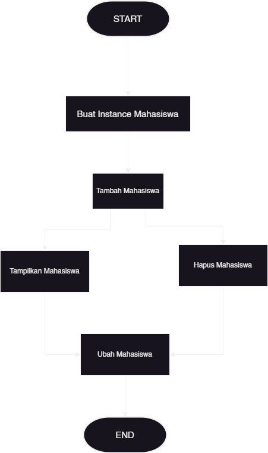

# Tugas Praktikum

## Deskripsi

Tugas praktikum ini bertujuan untuk membuat program sederhana menggunakan class dan metode dalam Python.

## Diagram class


## Flowchart



## Fitur

- `tambah(nama)`: Menambahkan data mahasiswa baru ke dalam daftar.
- `tampilkan()`: Menampilkan daftar mahasiswa yang telah ditambahkan.
- `hapus(nama)`: Menghapus data mahasiswa berdasarkan nama.
- `ubah(nama_lama, nama_baru)`: Mengubah data mahasiswa dari nama lama menjadi nama baru.

## Penggunaan

1. Buat objek `Mahasiswa`.
2. Panggil metode-metode yang tersedia, seperti `tambah()`, `tampilkan()`, `hapus()`, dan `ubah()`.
3. Ikuti alur pada flowchart untuk memahami operasi yang tersedia.

Contoh penggunaan:

```python
mahasiswa = Mahasiswa()
mahasiswa.tambah("Udin Stark")
mahasiswa.tambah("Praroro Julianto")
mahasiswa.tampilkan()
mahasiswa.hapus("Praroro Julianto")
mahasiswa.ubah("Udin Stark", "Suneo Junaedi")
mahasiswa.tampilkan()
```

